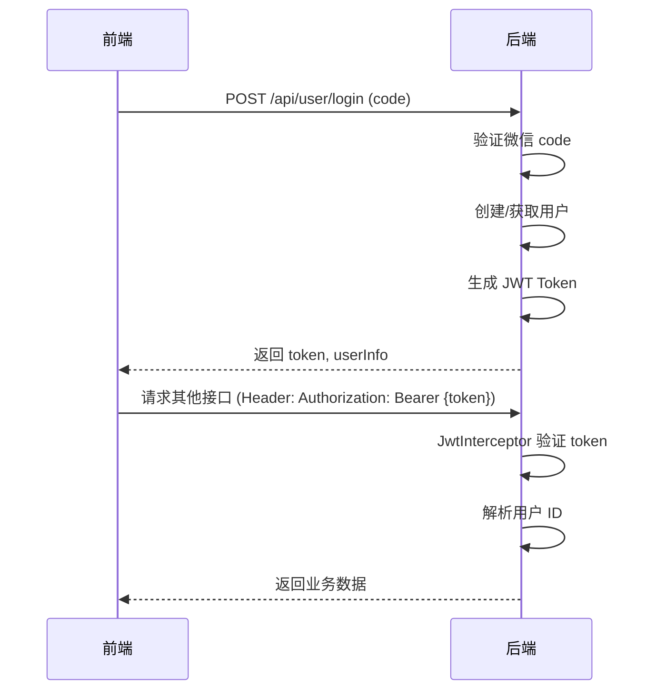

# 校园微墙 - 后端项目设计文档

## 1. 项目简介

校园微墙是一款面向大学生的校园社交应用，提供帖子发布、互动交流、私信聊天等功能，旨在打造一个轻松、有趣的校园交流平台。

### 核心功能
- 用户认证（微信登录）
- 帖子发布与浏览（支持匿名、图片、话题标签）
- 帖子互动（点赞、收藏、评论）
- 搜索功能（用户、帖子）
- 私信聊天
- 个人主页管理

---

## 2. 技术栈

| 分类 | 技术 | 版本 | 说明 |
| :--- | :--- | :--- | :--- |
| 语言 | Java | 21 | LTS 版本，性能稳定 |
| 框架 | Spring Boot | 3.2.x | 社区成熟，生态完善 |
| 数据库 | MySQL | 8.0+ | 主流关系型数据库 |
| ORM | MyBatis Plus | 3.5.x | 简化 CRUD 操作 |
| 认证 | JWT | - | 无状态身份认证 |
| API文档 | Knife4j | 4.3.x | Swagger UI 增强版 |
| 工具 | Lombok | 1.18.x | 简化代码 |

---

## 3. 核心业务模块

| 模块 | 说明 | 主要功能 |
| :--- | :--- | :--- |
| **用户模块** | 用户管理 | 登录、注册、信息更新、关注 |
| **帖子模块** | 帖子管理 | 发布、浏览、点赞、收藏 |
| **评论模块** | 评论管理 | 评论发布、点赞、回复 |
| **私信模块** | 消息管理 | 聊天记录、消息发送 |
| **搜索模块** | 搜索服务 | 用户搜索、帖子搜索 |

---

## 4. 项目目录结构

```plaintext
backend/                              # Maven 后端应用根目录
├── src/
│   └── main/
│       ├── java/
│       │   └── com/example/schoolwall/
│       │       ├── controller/       # REST API 控制层
│       │       │   ├── UserController.java
│       │       │   ├── PostController.java
│       │       │   ├── CommentController.java
│       │       │   ├── MessageController.java
│       │       │   └── SearchController.java
│       │       ├── service/          # 业务逻辑层
│       │       │   ├── impl/         # 实现类
│       │       │   ├── UserService.java
│       │       │   ├── PostService.java
│       │       │   ├── CommentService.java
│       │       │   └── MessageService.java
│       │       ├── mapper/           # 数据访问层
│       │       │   ├── UserMapper.java
│       │       │   ├── PostMapper.java
│       │       │   ├── CommentMapper.java
│       │       │   └── MessageMapper.java
│       │       ├── entity/           # 数据库实体
│       │       │   ├── User.java
│       │       │   ├── Post.java
│       │       │   ├── Comment.java
│       │       │   ├── LikeRecord.java
│       │       │   ├── CollectRecord.java
│       │       │   ├── FollowRecord.java
│       │       │   └── Message.java
│       │       ├── dto/              # 数据传输对象
│       │       │   ├── request/      # 请求 DTO
│       │       │   └── response/     # 响应 DTO
│       │       ├── config/           # 配置类
│       │       │   ├── WebConfig.java
│       │       │   ├── JwtConfig.java
│       │       │   └── Knife4jConfig.java
│       │       ├── security/         # 安全相关
│       │       │   ├── JwtTokenUtil.java
│       │       │   └── JwtInterceptor.java
│       │       ├── exception/        # 异常处理
│       │       │   ├── GlobalExceptionHandler.java
│       │       │   └── BusinessException.java
│       │       ├── util/             # 工具类
│       │       │   ├── Result.java
│       │       │   └── FileUploadUtil.java
│       │       └── SchoolWallApplication.java  # 启动类
│       └── resources/
│           ├── application.yml       # 应用配置
│           └── mapper/               # MyBatis XML
└── pom.xml                           # Maven 依赖管理
```

---

## 5. JWT 认证方案

### 5.1 认证流程



### 5.2 Token 结构

| 字段 | 说明 |
| :--- | :--- |
| `sub` | 用户 ID |
| `nickname` | 用户昵称 |
| `avatar` | 用户头像 |
| `exp` | 过期时间（7天） |

### 5.3 认证注解

- `@LoginRequired` - 标记需要登录的接口
- `@Anonymous` - 标记允许匿名访问的接口

---

## 6. 接口规范

### 6.1 基础路径

- 接口前缀: `/api`
- 示例: `GET /api/posts`

### 6.2 HTTP 状态码

| 状态码 | 含义 |
| :--- | :--- |
| `200` | 请求成功 |
| `400` | 请求参数错误 |
| `401` | 未登录或 token 失效 |
| `403` | 无权限访问 |
| `404` | 资源不存在 |
| `500` | 服务器内部错误 |

### 6.3 请求头

| 字段 | 说明 | 必填 |
| :--- | :--- | :--- |
| `Authorization` | Bearer Token | 否（登录接口除外） |
| `Content-Type` | application/json | 是（POST/PUT） |

---

## 7. Result 统一返回结构

```json
{
    "code": 200,
    "message": "success",
    "data": {},
    "timestamp": 1620000000000
}
```

| 字段 | 类型 | 说明 |
| :--- | :--- | :--- |
| `code` | Integer | 状态码 |
| `message` | String | 提示信息 |
| `data` | Object | 响应数据 |
| `timestamp` | Long | 时间戳 |

### 常用状态码

| Code | Message | 说明 |
| :--- | :--- | :--- |
| `200` | success | 成功 |
| `400` | 请求参数错误 | 参数校验失败 |
| `401` | 未登录 | 需要登录 |
| `403` | 无权限 | 权限不足 |
| `404` | 资源不存在 | 找不到资源 |
| `500` | 服务器错误 | 内部异常 |

---

## 8. DTO/VO 规范

### 8.1 命名规范

| 类型 | 命名示例 | 说明 |
| :--- | :--- | :--- |
| 请求 DTO | `LoginRequest.java` | 后缀 `Request` |
| 响应 DTO | `UserResponse.java` | 后缀 `Response` |
| 视图对象 | `PostVO.java` | 后缀 `VO` |

### 8.2 通用字段

**请求 DTO 通用规则:**
- 使用 `@NotBlank`, `@NotNull`, `@Size` 等注解进行参数校验
- 字段名使用驼峰命名

**响应 DTO 通用规则:**
- 避免返回敏感信息（如密码）
- 日期字段统一返回时间戳或格式化字符串

---

## 9. 开发规范

### 9.1 代码风格

- 类名: PascalCase（大驼峰）
- 方法名/变量名: camelCase（小驼峰）
- 常量名: UPPER_CASE（大写加下划线）
- 缩进: 4 个空格

### 9.2 日志规范

- 使用 `@Slf4j` 注解
- 日志级别: `debug`(调试)、`info`(业务)、`warn`(警告)、`error`(错误)
- 日志格式: `log.info("{} 操作成功, id={}", operation, id)`

### 9.3 异常处理

- 自定义业务异常 `BusinessException`
- 使用 `@ControllerAdvice` 统一处理异常
- 禁止直接抛出底层异常给前端

### 9.4 事务管理

- 使用 `@Transactional` 注解
- 事务传播级别使用默认值
- 避免在循环中开启事务

---

## 10. 模块划分

| 模块 | Controller | Service | Mapper | Entity |
| :--- | :--- | :--- | :--- | :--- |
| 用户 | UserController | UserService | UserMapper | User, FollowRecord |
| 帖子 | PostController | PostService | PostMapper | Post, LikeRecord, CollectRecord |
| 评论 | CommentController | CommentService | CommentMapper | Comment |
| 消息 | MessageController | MessageService | MessageMapper | Message |
| 搜索 | SearchController | - | - | - |

---

## 11. 开发顺序建议

| 阶段 | 任务 | 说明 |
| :--- | :--- | :--- |
| **Phase 1** | 环境搭建 | Spring Boot + MyBatis Plus + MySQL |
| **Phase 2** | 用户模块 | 微信登录、用户信息管理 |
| **Phase 3** | 帖子模块 | 帖子 CRUD、点赞、收藏 |
| **Phase 4** | 评论模块 | 评论发布、点赞 |
| **Phase 5** | 搜索模块 | 用户搜索、帖子搜索 |
| **Phase 6** | 消息模块 | 私信聊天 |
| **Phase 7** | 联调测试 | 前后端联调、Bug 修复 |

### 推荐顺序

1. 数据库建表 → 2. 用户登录 → 3. 帖子列表 → 4. 帖子详情 → 5. 发布帖子 → 6. 评论 → 7. 搜索 → 8. 私信

---

## 附录：前端数据结构参考

### Post（帖子）
```json
{
    "id": 1,
    "title": "标题",
    "content": "内容",
    "images": [],
    "tag": "美食",
    "tagColor": "orange",
    "isAnon": true,
    "author": "匿名用户",
    "authorAvatar": "🐼",
    "authorId": 101,
    "likes": 128,
    "liked": false,
    "collected": false,
    "commentCount": 34,
    "time": "10分钟前",
    "fullTime": "2024年6月10日 12:34"
}
```

### Comment（评论）
```json
{
    "id": 1,
    "author": "用户名",
    "avatar": "🦊",
    "content": "评论内容",
    "time": "12:40",
    "likes": 23,
    "isAuthor": false
}
```

### User（用户）
```json
{
    "id": 999,
    "name": "我自己",
    "nickname": "橙子不甜",
    "avatar": "🍊",
    "school": "某某大学",
    "bio": "个人简介",
    "postCount": 12,
    "likeCount": 286,
    "collectCount": 43
}
```

### Message（消息）
```json
{
    "id": 1,
    "userId": 201,
    "name": "数学学长",
    "avatar": "🦁",
    "lastMsg": "消息内容",
    "lastTime": "刚刚",
    "unread": 2
}
```
